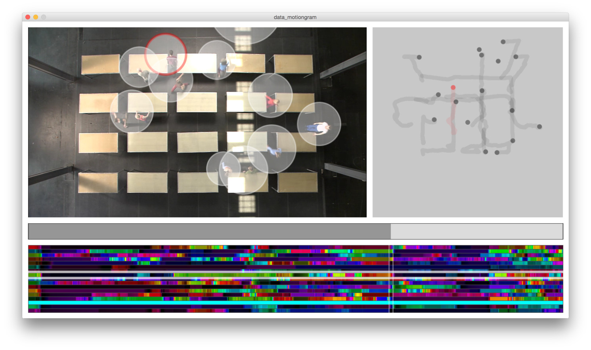
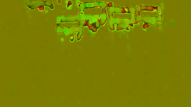

## Motion Maps of Dance ##

This is the repository of the Choreographic Maps project, started at the [5th Choreographic Coding Lab](http://choreographiccoding.org/content/5th-choreographic-coding-lab-14-19-september-2015) at UCLA. More information can be found on the [Motion Maps Hackpad](https://motionbank.hackpad.com/Motion-Maps-of-Dance-bCp115GQkTE).

## Ideas ##

* **MotionGram Explorer**: Using MotionGrams as a means to explore motion in recordings of dance
* **MotionMap Explorer**: Folding the timeline of dance recording(s) on a 2D Self-Orgnanizing Map

## MotionGram Explorer ##

First version of the MotionGram Explorer, visualizing the trajectories of dancers as motiongrams.

 

## MotionMap Explorer ##

Coming soon ...

## Code ##

### Optical Flow ###

Convert videos into *optical flow recordings*, where vertical and horizontal motion are encoded in color components of the respective pixels. (Here: *R* and *G* components)

This is a optical flow recording of *One Flat Thing reproduced*.  When Tables are pushed on to the stage, the vertical motion of their outlines results in color changes.

## License ##

**D**o **W**hat **T**he **F**uck you want to **P**ublic **L**icense.

